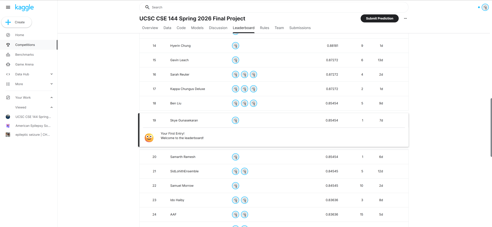

# CSE 144 Final Project: Transfer Learning Challenge

This repository contains our solution for the CSE 144 Transfer Learning Challenge. The model uses a pretrained DINOv3 Vision Transformer backbone with a lightweight classification head for 100-way image classification.

## Repository Structure

```text
.
├── train.py
├── best_model.pth              # downloaded model weights
├── submission.csv              # generated after inference
├── kaggle_leaderboard.png      # screenshot of Kaggle leaderboard position
└── README.md
```

## Model Weights

The trained model weights can be downloaded from Google Drive:

[Download model weights](https://drive.google.com/file/d/13Uqq8PYKX6s-JPHDFoWWJgyOMYBy-8hw/view?usp=sharing)

After downloading, place the checkpoint in the repository root and name it:

```text
best_model.pth
```

## Dataset Setup

The code expects the dataset directory to contain `train/` and `test/` folders in the following format:

```text
dataset/
├── train/
│   ├── 0/
│   │   ├── image1.jpg
│   │   └── ...
│   ├── 1/
│   └── ...
│   └── 99/
└── test/
    ├── 0.jpg
    ├── 1.jpg
    └── ...
```

The class label is determined directly from the training folder name, so folder `0` maps to label `0`, folder `1` maps to label `1`, and so on through folder `99`.

## Environment Setup

Install the required Python packages:

```bash
pip install torch torchvision transformers pillow numpy pandas matplotlib seaborn
```

A CUDA-enabled GPU is recommended for training. The script will automatically use CUDA if available, otherwise it will fall back to MPS or CPU.

## Training

To train the model from scratch, run:

```bash
python train.py \
  --data_dir /path/to/dataset \
  --mode train \
  --checkpoint best_model.pth \
  --output_csv submission.csv \
  --loss_plot loss_curve.png
```

Example:

```bash
python train.py \
  --data_dir ./dataset \
  --mode train \
  --checkpoint best_model.pth \
  --output_csv submission.csv \
  --loss_plot loss_curve.png
```

By default, the training script uses:

* DINOv3 ViT-B/16 pretrained backbone
* Frozen backbone with a trainable classification head
* Cross-entropy loss with label smoothing
* AdamW optimizer
* Cosine annealing learning-rate scheduler
* Batch size of 128
* 20 training epochs
* 15% validation split
* Early stopping with patience of 10 epochs

Training will save the best validation checkpoint to `best_model.pth` and will also generate a Kaggle-ready `submission.csv`.

## Inference

To run inference using the provided trained weights, first download `best_model.pth` from the Google Drive link above and place it in the repository root.

Then run:

```bash
python train.py \
  --data_dir /path/to/dataset \
  --mode infer \
  --checkpoint best_model.pth \
  --output_csv submission.csv
```

Example:

```bash
python train.py \
  --data_dir ./dataset \
  --mode infer \
  --checkpoint best_model.pth \
  --output_csv submission.csv
```

This will generate:

```text
submission.csv
```

The output file follows the Kaggle submission format:

```text
ID,Label
0.jpg, predicted_label
1.jpg, predicted_label
...
```

## Kaggle Leaderboard

Our team’s Kaggle leaderboard position is shown below:



Make sure `kaggle_leaderboard.png` is included in the repository root so that the image renders correctly on GitHub.

## Reproducibility Notes

The script sets the random seed to `42` for Python, NumPy, and PyTorch. The validation split is also generated using this seed.

To reproduce the final submission:

```bash
python train.py \
  --data_dir ./dataset \
  --mode infer \
  --checkpoint best_model.pth \
  --output_csv submission.csv
```

Then upload `submission.csv` to Kaggle.
